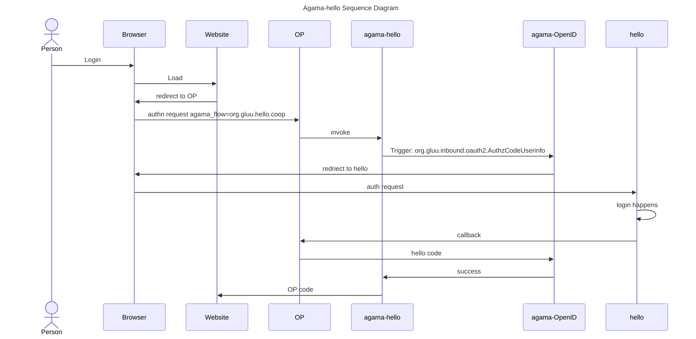

<p align="center">

</p>

<!-- These are statistics for this repository-->
[![Contributors][contributors-shield]][contributors-url]
[![Forks][forks-shield]][forks-url]
[![Stargazers][stars-shield]][stars-url]
[![Issues][issues-shield]][issues-url]
[![Apache License][license-shield]][license-url]

# About Agama-Hellō


This repo is home to the Gluu Agama-hello project. This Agama project provides
integration with [hello.coop](https://hello.coop)
platform, which supports a variety of
authenticators and social sign-in options.


## Where To Deploy

The project can be deployed to any IAM server that runs an implementation of
the [Agama Framework](https://docs.jans.io/head/agama/introduction/) like
[Janssen Server](https://jans.io) and [Gluu Flex](https://gluu.org/flex/).


## How To Deploy

Different IAM servers may provide different methods and
user interfaces from where an Agama project can be deployed on that server.
The steps below show how the Agama-hello project can be deployed on the
[Janssen Server](https://jans.io).

Deployment of an Agama project involves three steps.

- [Downloading the `.gama` package from the project repository](#download-the-project)
- [Adding the `.gama` package to the IAM server](#add-the-project-to-the-server)
- [Configure the project](#configure-the-project)


#### Pre-Requisites
- Agama-Hello project calls the flows from the 
[agama-openid](https://github.com/GluuFederation/agama-openid) project. Hence
a working deployment of agama-openid on the same IAM server is required. For 
instructions on how to deploy and configure the agama-openid project, please
visit the [README](https://github.com/GluuFederation/agama-openid)
- Credentials: You will need client credentials 
from [Hellō SaaS](https://hello.coop) to authenticate and authorize 
access to their platform.


### Download The Project

> [!TIP]
> Skip this step if you use the Janssen Server TUI tool to
> configure this project. The TUI tool enables the download and adding of this
> project directly from the tool, as part of the `community projects` listing.

The project is bundled as
[.gama package](https://docs.jans.io/head/agama/gama-format/).
Visit the `Assets` section of the
[Releases](https://github.com/GluuFederation/agama-hello/releases) to download
the `.gama` package.


### Add The Project To The Server

The Janssen Server provides multiple ways an Agama project can be
deployed and configured. Either use the command-line tool, REST API, or a
TUI (text-based UI). Refer to the [Agama project configuration page](https://docs.jans.io/head/admin/config-guide/auth-server-config/agama-project-configuration/) in the Janssen Server documentation for more details.


### Configure The Project

The Agama project accepts configuration parameters in the JSON format. Every Agama
project comes with a basic sample configuration file for reference.

Below is a typical configuration of the Agama-hello project. As shown, it contains
configuration parameters for the [flows contained in it](#flows-in-the-project):

Sample JSON:
```
{
  "org.gluu.hello.coop": {
    "hello": {
      "oauth": {
        "authzEndpoint": "https://wallet.hello.coop/authorize",
        "tokenEndpoint": "https://wallet.hello.coop/oauth/token",
        "userInfoEndpoint": "https://wallet.hello.coop/oauth/userinfo",
        "clientId": "CLIENT_INDENTIFIER",
        "clientSecret": "CLIENT_SECRET",
        "scopes": [
          "openid"
        ]
      },
      "uidPrefix": "hello-"
    }
  }
}
```


### Test The Flow

Use any relying party implementation (like [jans-tarp](https://github.com/JanssenProject/jans/tree/main/demos/jans-tarp))
to send an authentication request that triggers the flow.

From the incoming authentication request, the Janssen Server reads the `ACR`
parameter value to identify which authentication method should be used.
To invoke the `org.gluu.hello.coop` flow contained in the Agama-hello project,
specify the ACR value as `agama_<qualified-name-of-the-top-level-flow>`,
i.e `agama_org.gluu.hello.coop`.


## Customize and Make It Your Own

Fork this repo to start customizing the Agama-hello project. It is possible to
customize the user interface provided by the flow to suit your organisation's
branding
guidelines.   Or customize the overall flow behavior. Follow the best
practices and steps listed
[here](https://docs.jans.io/head/admin/developer/agama/agama-best-practices/#project-reuse-and-customizations)
to achieve these customizations in the best possible way.
This project can be reused in other Agama projects to create more complex
authentication journeys.  To reuse, trigger the
[org.gluu.hello.coop](#flows-in-the-project) flow from other Agama projects.

To make it easier to visualise and customize the Agama Project, use
[Agama Lab](https://cloud.gluu.org/agama-lab/login).

## Flows In The Project

| Qualified Name | Description |
|----------------|-------------|
| `org.gluu.hello.coop`| Main agama flow of this project. It first collects the configuration details and triggers to `org.gluu.inbound.oauth2.AuthzCodeWithUserInfo` flow of agama-openid project. After successful authentication, redirect to this main flow for the user onboard. Kindly check the [diagram](#sequence-diagram) for better understanding.


# Sequence Diagram
A basic diagram to understand how the `agama-hello` works.




# Demo

You'll need an OpenID Connect test RP. You can try [oidcdebugger](https://oidcdebugger.com/),
[jans-tarp](https://github.com/JanssenProject/jans/tree/main/demos/jans-tarp) or [jans-tent](https://github.com/JanssenProject/jans/tree/main/demos/jans-tent).
Check out this video to see an example of **agama-hello** in action:


<!--

-->

# Acknowledgements

This project is based on [agama-openid](https://github.com/GluuFederation/agama-openid).

<!-- These are stats url references for this repository -->
[contributors-shield]: https://img.shields.io/github/contributors/GluuFederation/agama-hello.svg?style=for-the-badge
[contributors-url]: https://github.com/GluuFederation/agama-hello/graphs/contributors
[forks-shield]: https://img.shields.io/github/forks/GluuFederation/agama-hello.svg?style=for-the-badge
[forks-url]: https://github.com/GluuFederation/agama-hello/network/members
[stars-shield]: https://img.shields.io/github/stars/GluuFederation/agama-hello?style=for-the-badge
[stars-url]: https://github.com/GluuFederation/agama-hello/stargazers
[issues-shield]: https://img.shields.io/github/issues/GluuFederation/agama-hello.svg?style=for-the-badge
[issues-url]: https://github.com/GluuFederation/agama-hello/issues
[license-shield]: https://img.shields.io/github/license/GluuFederation/agama-hello.svg?style=for-the-badge
[license-url]: https://github.com/GluuFederation/agama-hello/blob/master/LICENSE
